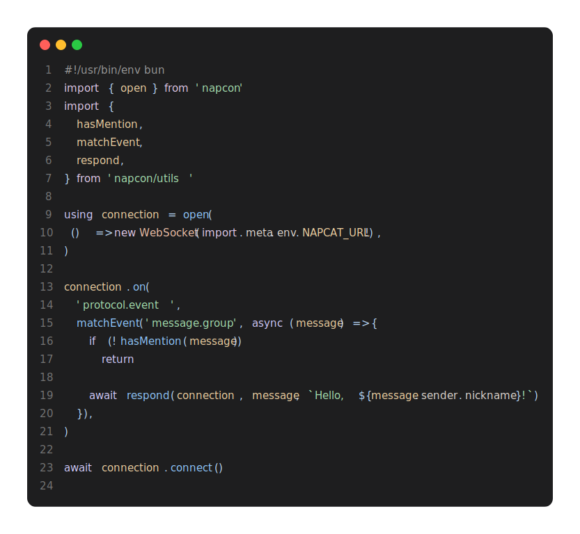

# NapCon
> Moved to [`napcon`](https://npmjs.com/napcon)

A lightweight TypeScript library for [NapCat](https://github.com/NapNeko/NapCatQQ) and [OneBot v11](https://11.onebot.dev).

> **Note**: This library is currently in active development. APIs are subject to change.

## Features

- **Ultra-lightweight**: Zero dependencies, ~1.7KB gzipped.
- **Simple API**: Connect to the server with a single `open(...)` method.
- **TypeScript First**: Comprehensive type definitions for events and methods.
- **Rich Utilities**: Built-in message builders, guards, and helper functions.

## Example
This is a simple example of using NapCon to respond to group at messages with `Hello, [nickname]!`.

Check out [examples](https://github.com/suisanka/napcon/blob/main/examples/) for usage examples.
